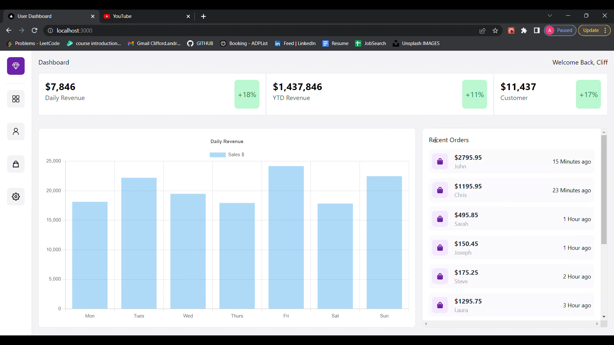

# Business Admin Dashboard

## This Next.js project was designed with the intent of providing a dashboard for businesses to track users, payments and orders. 

Responsive dashboard interface for businesses to track users, payments and orders. Chart.js was used to create a responsive graph for businesses to monitor daily revenue. Styled with tailwind CSS.

* Next.js, react-icons and tailwind CSS used to efficiently generate a user-friendly, responsive website
* Information displayed with dummy data stored manually
* Chart.jsx used to create a responsive graph for business to monitor daily revenue

## Watch the demo
<a href="https://www.youtube.com/watch?v=j_0gAi-mRqQ" target="_blank">
  
</a>


## How to run this project on your local device

First, run the development server:

```bash
npm run dev
# or
yarn dev
# or
pnpm dev
```

Open [http://localhost:3000](http://localhost:3000) with your browser to see the result.

You can start editing the page by modifying `pages/index.js`. The page auto-updates as you edit the file.

## Find a bug? 
feel free to contact me via email


